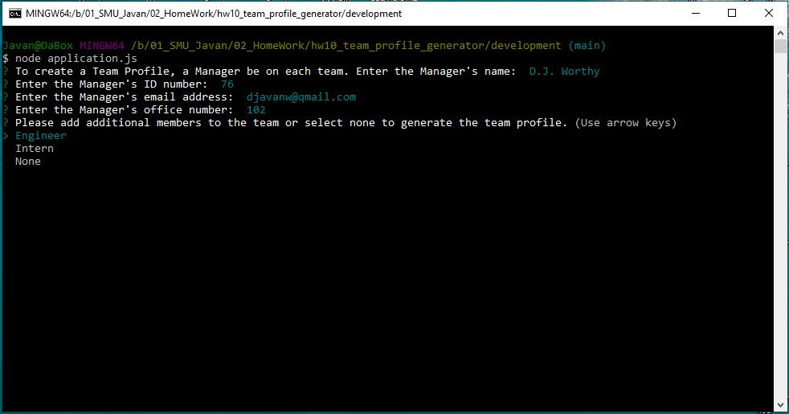
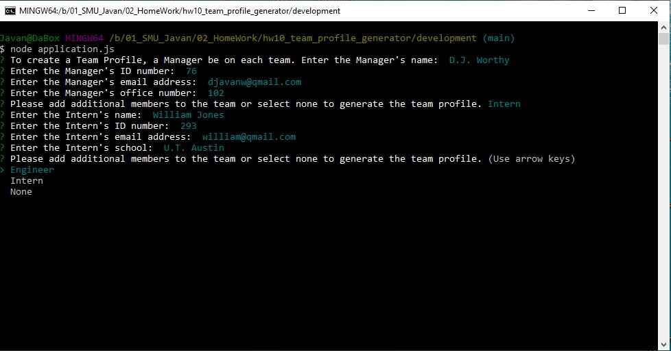
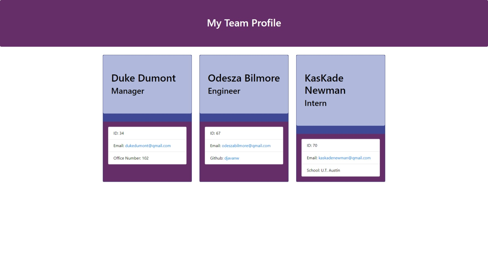

# Assignment 10:  Team Profile Generator

  

***

  ## Description:
  This is a command-line application that takes user input to generate a team profile roster.  The user will be asked a series of questions that must be answered and upon completion, a roster will be generated with the relevant information of each team member.

***
  ## Demostration:
  [Video Demo](https://youtu.be/j87_kDIbs2E)
***
  ## Table of Contents:
  1.  [Description](#description)
  2.  [Demostration](#demostration)
  3.  [Installation](#installation)
  4.  [Technologies](#technologies)
  5.  [Usage](#usage)
  6.  [Screenshots](#screenshots)
  7.  [License](#license)
  8.  [Contributing](#contributing)
  9.  [Tests](#tests)
  10.  [Questions](#questions)

***
  ## Installation:
  This application requires a Node.js JavaScript runtime environment and the inquirer module in order to run.  A `.gitignore` file that includes `node_modules/` and `.DS_Store/` must be created in order to not track the `nodes_modules` or upload it to GitHub and this must be accomplished before installing any npm dependencies.  In addition, a `package.json` with the required dependencies must be included into the repository.  This must be created before installing any dependencies by running the following command: `npm init`.  The following package must also be loaded:  inquirer.  

***
  ## Technologies:
  - HTML
  - CSS
  - JavaScript
  - Node.js

***
  ## Usage:
  The user will invoke the application by typing `node application.js` and will then proceed to answer the questions when they are presented.  A manager must be entered for each team.  There is validation logic in the application to ensure a manager is on each team.  
   
***
## Screenshots 
### (Invoking Application and Responding to Questions)

### (Adding addition Team Members)

### (Team Profile Generated)

***
  ## License:
  This project falls under the MIT License.  The full documentation for this license can be found at [MIT Full Documentation](https://choosealicense.com/licenses/mit).

  Below is an excerpt of the MIT License.
   
  Copyright <YEAR> <COPYRIGHT HOLDER>
    
    Permission is hereby granted, free of charge, to any person obtaining a copy of this software and associated documentation files (the "Software"), to deal in the Software without restriction, including without limitation the rights to use, copy, modify, merge, publish, distribute, sublicense, and/or sell copies of the Software, and to permit persons to whom the Software is furnished to do so, subject to the following conditions:
    The above copyright notice and this permission notice shall be included in all copies or substantial portions of the Software.
    THE SOFTWARE IS PROVIDED "AS IS", WITHOUT WARRANTY OF ANY KIND, EXPRESS OR IMPLIED, INCLUDING BUT NOT LIMITED TO THE WARRANTIES OF MERCHANTABILITY, FITNESS FOR A PARTICULAR PURPOSE AND NONINFRINGEMENT. IN NO EVENT SHALL THE AUTHORS OR COPYRIGHT HOLDERS BE LIABLE FOR ANY CLAIM, DAMAGES OR OTHER LIABILITY, WHETHER IN AN ACTION OF CONTRACT, TORT OR OTHERWISE, ARISING FROM, OUT OF OR IN CONNECTION WITH THE SOFTWARE OR THE USE OR OTHER DEALINGS IN THE SOFTWARE.

  ## Contributing:
  The contributors for this project are: D. Javan Worthy.
   
  To contribute to this project, please submit pull requests for any minor changes; however, please open an issue for any changes that are significant.

***
  ## Tests:
  This application does have testing parameters; however, the user does not have to execute this option.  The test performed by the developer was executed with the module package called `jest`.  Jest is a testing framework that provides a simple and methodical way of testing code to ensure the application will run in production.  Jest is a dev dependencies and the user would need to install this package to run the test with the command-line text of `npm run test`.

***
  ## Questions:
  - The GitHub profile for this project is https://github.com/djavanw.
 
  - If there are any questions, the contributor can be reached at djavanw@ghittohubb.net.
